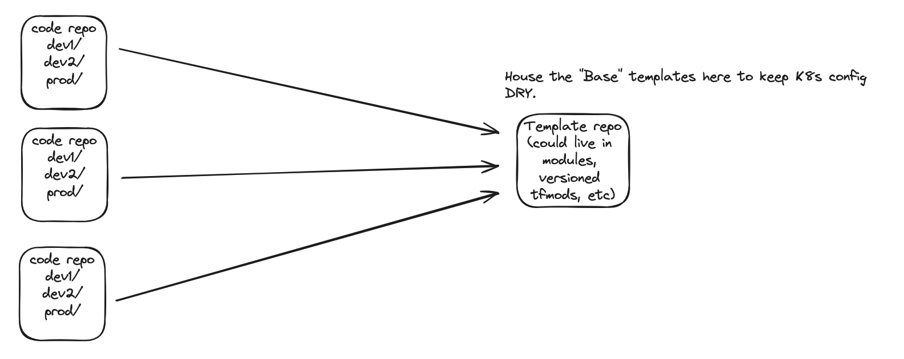

# kustomize_base


## This is an example repo for using kustomize to manage K8s manifests.


## K8s Config Architecture

This is a single repo but the idea is to treat the `dev` as a directory living in a source code repo and the `base` directory living in a **remote** mono repo of some sort that can be treated as a resuable template for many micro services.




### Example

```
cd dev/

kustomize build
apiVersion: v1
kind: Namespace
metadata:
  labels:
    app: backend-api
  name: backend-api-dev
---
apiVersion: v1
kind: Service
metadata:
  labels:
    app: backend-api
  name: backend-api
  namespace: backend-api-dev
spec:
  ports:
  - name: http
    port: 8080
  selector:
    app: backend-api
---
apiVersion: apps/v1
kind: Deployment
metadata:
  labels:
    app: backend-api
  name: backend-api
  namespace: backend-api-dev
spec:
  selector:
    matchLabels:
      app: backend-api
  spec:
    containers:
    - image: foo/bar:latest
      name: app
      ports:
      - containerPort: 8080
        name: http
        protocol: TCP
  template:
    metadata:
      labels:
        app: backend-api
---
apiVersion: autoscaling/v2beta2
kind: HorizontalPodAutoscaler
metadata:
  labels:
    app: backend-api
  name: backend-api
  namespace: backend-api-dev
spec:
  apiVersion: apps/v1
  kind: Deployment
  maxReplicas: 10
  metrics:
  - type: Resource
  minReplicas: 1
  name: frontend
  resource:
    name: cpu
    target:
      averageUtilization: 70
      type: Utilization
```


# ArgoCD Deployment


Build kind cluster

```
kind create cluster --config cluster.yaml
```


```
kubectl create namespace argocd
kubectl apply -n argocd -f https://raw.githubusercontent.com/argoproj/argo-cd/stable/manifests/install.yaml


kubectl port-forward svc/argocd-server -n argocd 8080:443
```

Get the initial password:

```
argocd admin initial-password -n argocd
```


# Install Flux

https://docs.gitops.weave.works/docs/open-source/getting-started/install-OSS/

```
brew install fluxcd/tap/flux
```
